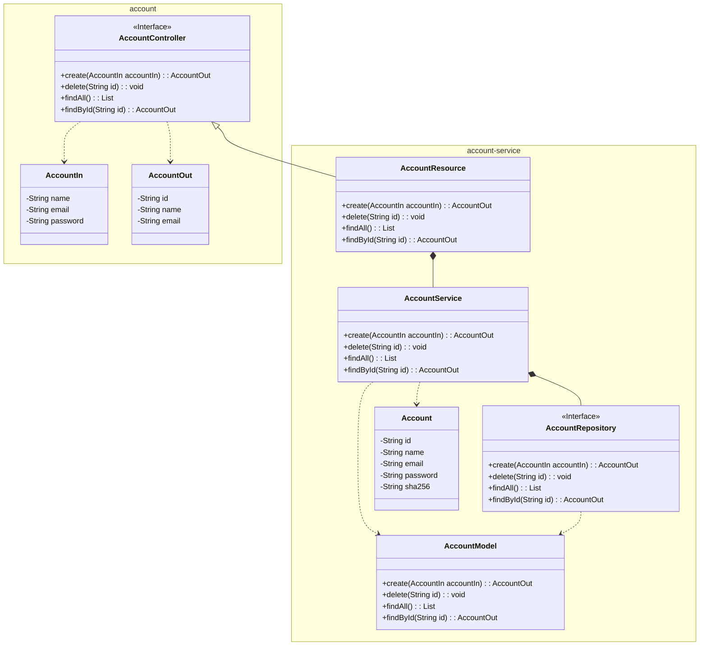
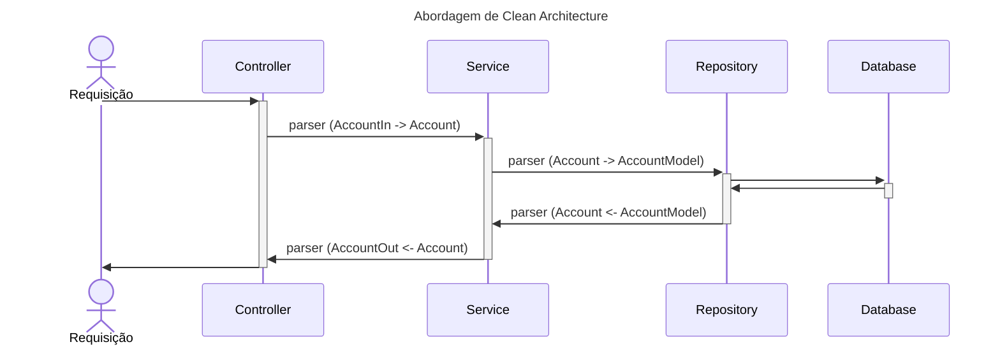
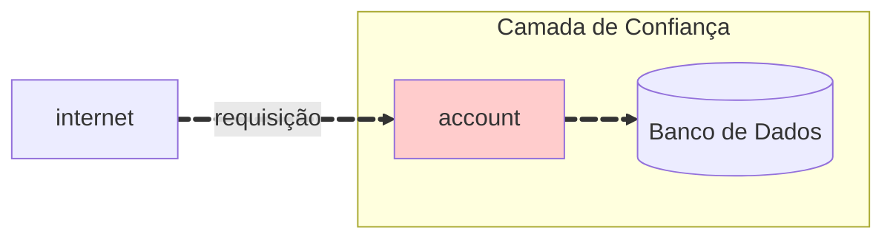

## Microserviço de Conta

O microserviço de Conta é responsável por gerenciar contas de usuário — basicamente, quase toda aplicação possui um sistema de contas. Este microserviço fornece os endpoints necessários para criar, ler, atualizar e excluir contas. O microserviço é construído com Spring Boot e segue a abordagem de Domain-Driven Design (DDD).

O microserviço está dividido em dois módulos principais: `account` e `account-service`:

* o módulo `account` contém a definição da API e os objetos de transferência de dados (DTOs) para o microserviço de Conta;
* o módulo `account-service` contém a implementação do serviço, repositório e classes de entidade.



Essa abordagem permite a separação de responsabilidades e a organização da base de código em módulos distintos, tornando-a mais fácil de manter e escalar. Além disso, cria uma facilidade para reutilizar o microserviço por outros serviços no futuro — construído em Java.

A construção do microserviço de Conta segue a abordagem de Clean Architecture, que promove o desacoplamento total das regras de negócio das camadas de interface. O diagrama abaixo ilustra o fluxo de dados entre as camadas do microserviço de Conta:



Antes de construir o microserviço de Conta, é necessário preparar o ambiente instalando o banco de dados para persistir os dados. Para isso, usaremos um arquivo Docker Compose para criar um container PostgreSQL, assim como um cluster para isolar os microserviços do acesso externo, criando um ambiente seguro — camada de confiança. Um arquivo Docker Compose é um arquivo YAML que define como os containers Docker devem se comportar em produção. O arquivo contém a configuração para o banco de dados, os microserviços e a configuração de rede.



## Docker Compose

```bash
api/
    account/
    account-service/
    .env
    compose.yaml
```

\=== "compose.yaml"

```yaml
--8<-- "https://raw.githubusercontent.com/Insper/platform/refs/heads/main/api/compose.yaml"
```

\=== ".env"

```bash
--8<-- "https://raw.githubusercontent.com/Insper/platform/refs/heads/main/api/.env"
```

<!-- termynal -->

```bash
> docker compose up -d --build

[+] Running 2/2
 ✔ Network store_default  Created            0.1s 
 ✔ Container store-db-1   Started            0.2s 
```

## Conta

```bash
api/
    account/
        src/
            main/
                java/
                    store/
                        account/
                            AccountController.java
                            AccountIn.java
                            AccountOut.java
        pom.xml
```

??? info "Fonte"

\=== "pom.xml"

```yaml
--8<-- "https://raw.githubusercontent.com/hsandmann/insper.store.account/refs/heads/main/pom.xml"
```

\=== "AccountController"

```java
--8<-- "https://raw.githubusercontent.com/hsandmann/insper.store.account/refs/heads/main/src/main/java/store/account/AccountController.java"
```

\=== "AccountIn"

```java
--8<-- "https://raw.githubusercontent.com/hsandmann/insper.store.account/refs/heads/main/src/main/java/store/account/AccountIn.java"
```

\=== "AccountOut"

```java
--8<-- "https://raw.githubusercontent.com/hsandmann/insper.store.account/refs/heads/main/src/main/java/store/account/AccountOut.java"
```

<!-- termynal -->

```bash
> mvn clean install
```

## Account-Service

```bash
api/
    account-service/
        src/
            main/
                java/
                    store/
                        account/
                            Account.java
                            AccountApplication.java
                            AccountModel.java
                            AccountParser.java
                            AccountRepository.java
                            AccountResource.java
                            AccountService.java
                resources/
                    application.yaml
                    db/
                        migration/
                            V2025.02.21.001__create_schema_account.sql
                            V2025.02.21.002__create_table_account.sql
        pom.xml
        Dockerfile
```

??? info "Fonte"

\=== "pom.xml"

```yaml
--8<-- "https://raw.githubusercontent.com/hsandmann/insper.store.account-service/refs/heads/main/pom.xml"
```

\=== "application.yaml"

```yaml
--8<-- "https://raw.githubusercontent.com/hsandmann/insper.store.account-service/refs/heads/main/src/main/resources/application.yaml"
```

\=== "Account.java"

```java
--8<-- "https://raw.githubusercontent.com/hsandmann/insper.store.account-service/refs/heads/main/src/main/java/store/account/Account.java"
```

\=== "AccountApplication.java"

```java
--8<-- "https://raw.githubusercontent.com/hsandmann/insper.store.account-service/refs/heads/main/src/main/java/store/account/AccountApplication.java"
```

\=== "AccountModel.java"

```java
--8<-- "https://raw.githubusercontent.com/hsandmann/insper.store.account-service/refs/heads/main/src/main/java/store/account/AccountModel.java"
```

\=== "AccountParser.java"

```java
--8<-- "https://raw.githubusercontent.com/hsandmann/insper.store.account-service/refs/heads/main/src/main/java/store/account/AccountParser.java"
```

\=== "AccountRepository.java"

```java
--8<-- "https://raw.githubusercontent.com/hsandmann/insper.store.account-service/refs/heads/main/src/main/java/store/account/AccountRepository.java"
```

\=== "AccountResource.java"

```java
--8<-- "https://raw.githubusercontent.com/hsandmann/insper.store.account-service/refs/heads/main/src/main/java/store/account/AccountResource.java"
```

\=== "AccountService.java"

```java
--8<-- "https://raw.githubusercontent.com/hsandmann/insper.store.account-service/refs/heads/main/src/main/java/store/account/AccountService.java"
```

\=== "V2025.02.21.001\_\_create\_schema\_account.sql"

```sql
--8<-- "https://raw.githubusercontent.com/hsandmann/insper.store.account-service/refs/heads/main/src/main/resources/db/migration/V2025.02.21.001__create_schema_account.sql"
```

\=== "V2025.02.21.002\_\_create\_table\_account.sql"

```sql
--8<-- "https://raw.githubusercontent.com/hsandmann/insper.store.account-service/refs/heads/main/src/main/resources/db/migration/V2025.02.21.002__create_table_account.sql"
```

\=== "Dockerfile"

```dockerfile
--8<-- "https://raw.githubusercontent.com/hsandmann/insper.store.account-service/refs/heads/main/Dockerfile"
```

<!-- termynal -->

```bash
> mvn clean package spring-boot:run
```

<!--
## API

!!swagger-http http://127.0.0.1:8080/account/api-docs!! -->
